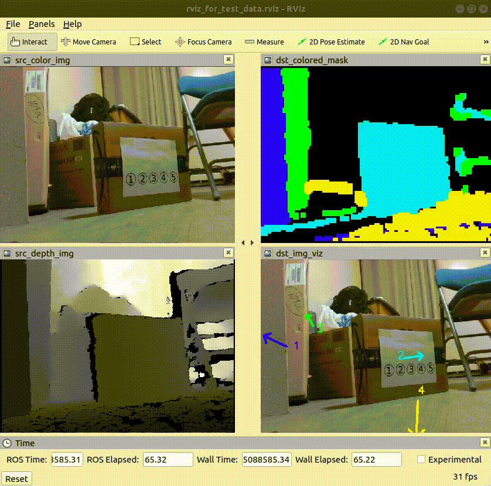

Detect Planes from Depth Image
=======================================

**Demo of usage:**  
```
ROOT=$(rospack find ros_detect_planes_from_depth_img)
rosrun ros_detect_planes_from_depth_img run_server.py \
    --config_file $ROOT/config/plane_detector_config.yaml \
    --depth_topic test_data/depth \
    --color_topic test_data/color \
    --camera_info $ROOT/data/cam_params_realsense.json
```

The main scripts are: [plane_detector.py](plane_detector.py), [run_server.py](run_server.py), and [config/plane_detector_config.yaml](config/plane_detector_config.yaml).

For a fast unit test, run: `bash run_unit_test.sh`

**Demo:**  



**Method:**
```
(1) Create point cloud from depth image
(2) while RANSAC hasn't failed:
(3)    Use RANSAC to detect a plane from point cloud.
(4)    Remove the plane's points from point cloud.
```

**Contents:**
  * [1. Results are published to ROS topics](#1-results-are-published-to-ros-topics)
  * [2. Test without ROS](#2-test-without-ros)
  * [3. Test in ROS](#3-test-in-ros)
    + [3.1. Publish color and depth images](#31-publish-color-and-depth-images)
    + [3.2. Run plane detection server](#32-run-plane-detection-server)
    + [3.3. View results in rviz](#33-view-results-in-rviz)

## 1. Results are published to ROS topics

```
$ rostopic list
/detect_plane/colored_mask
/detect_plane/image_viz
/detect_plane/results
```

The plane detection results are published to the topic `detect_plane/results`, whose message type is [msg/PlanesResults.msg](msg/PlanesResults.msg):
``` yaml
int32 N                 # Number of detected planes.

# In the following arrays, 
# the planes' parameters are concatinated one by one.

float32[] norms         # Nx3. Plane normal (nx, ny, nz).
float32[] center_3d     # Nx3. Plane 3D center (cx, cy, cz).
float32[] center_2d     # Nx2. Plane 2D center on the image (px, py),
                        #   which means {px}th column, and {py}th row.
uint16[] mask_color     # Nx3. Plane mask color (blue, green, red). 
                        # Each color's range is [0, 255]
```


## 2. Test without ROS
```
python plane_detector.py
```

## 3. Test in ROS


### 3.1. Publish color and depth images
Please download another package for publishing color and depth images:
```
cd ~/catkin_ws/src
git clone https://github.com/felixchenfy/ros_pub_and_sub_rgbd_and_cloud
```

Then, we can publish the data:
```
ROOT=$(rospack find ros_detect_planes_from_depth_img)
rosrun ros_pub_and_sub_rgbd_and_cloud pub_rgbd_and_cloud.py \
    --base_dir $ROOT \
    --config_file $ROOT/config/pub_rgbd_config.yaml
```
The settings are in `config/pub_rgbd_images_config.yaml`:

### 3.2. Run plane detection server
```
ROOT=$(rospack find ros_detect_planes_from_depth_img)
rosrun ros_detect_planes_from_depth_img run_server.py \
    --config_file $ROOT/config/plane_detector_config.yaml \
    --depth_topic test_data/depth \
    --color_topic test_data/color \
    --camera_info $ROOT/data/cam_params_realsense.json
```

### 3.3. View results in rviz
```
ROOT=$(rospack find ros_detect_planes_from_depth_img)
rosrun rviz rviz -d $ROOT/config/rviz_for_test_data.rviz
```

